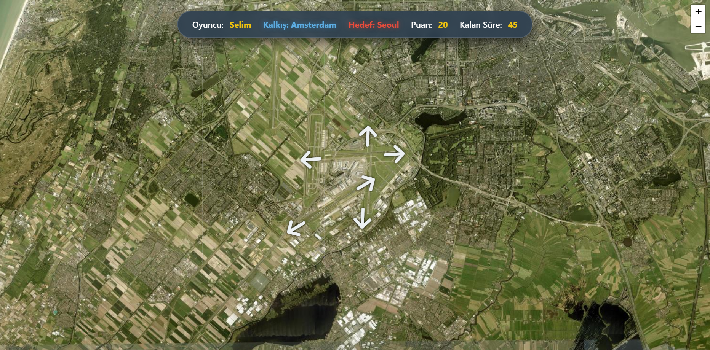
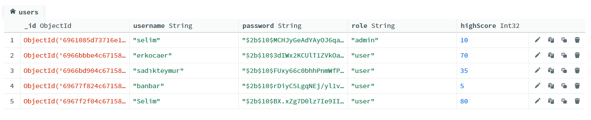
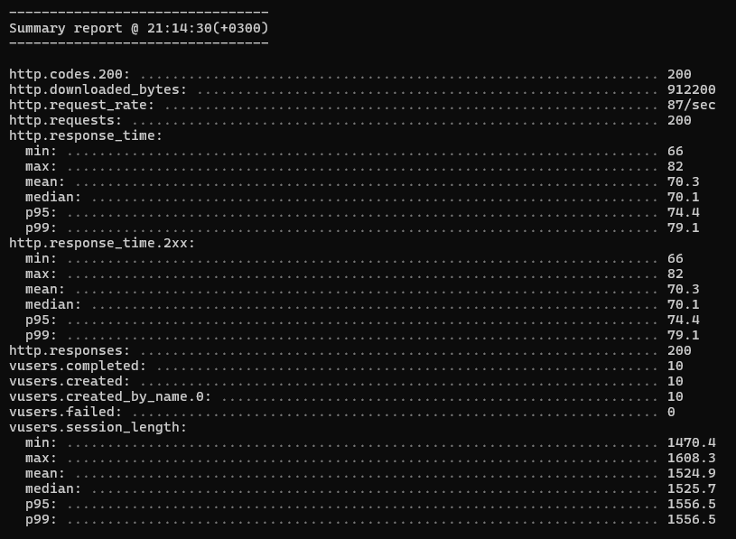

# ✈️ Ready for Departure: Cloud-Native Web GIS Platform

> **GMT 458 - Web GIS Final Project**
> *An interactive flight management game powered by real-time spatial queries and cloud architecture.*


---

**Link for presentation: [Proje Sunumunu İndir (PPTX)](Mustafa_Selim_Issı_Project_Presentation.pptx)**
 In case It doesn't work:[Proje Sunumunu İndir yedek (PPTX)](https://github.com/selimissi/GMT458-WebGIS-Project-selimissi/raw/refs/heads/main/Mustafa_Selim_Iss%C4%B1_Project_Presentation.pptx)

## 📖 Abstract & Project Overview
**Ready for Departure** is a Full-Stack Web GIS application designed to simulate air traffic control operations. The system challenges players to manage flight paths using real-world coordinates (WGS84) on an interactive map.

Unlike traditional web applications, this project integrates **Spatial Database** capabilities with a **Node.js** backend to perform real-time proximity analysis, geofencing, and trajectory validation. The entire infrastructure is deployed on a cloud server, mimicking a production-ready environment.

🔗 **Live Deployment:** [http://56.228.7.59:3000](http://56.228.7.59:3000)

---

## 🖼️ Gameplay Interface
*The platform features a secure authentication gateway and a real-time spatial simulation environment.*

### 1. Secure Login Screen
*Users must authenticate via the secure gateway to access personalized features.*


### 2. Main Game Interface
*The interactive map allows players to manage flight paths using real-time spatial queries.*



---

## 🎯 Implementation & Scoring Claims
This project fulfills the advanced requirements set by the GMT 458 curriculum, based on the following modules:

### 1. ☁️ Cloud Hosting & DevOps
* **Infrastructure:** Deployed on **Amazon Web Services (AWS)** EC2 instance (Region: eu-north-1 / Stockholm).
* **OS:** Ubuntu 22.04 LTS (Linux).
* **Process Management:** Utilized **PM2** for daemonizing the Node.js application, ensuring 99.9% uptime, load balancing, and automatic restarts.
* **Network Security:** Configured AWS Security Groups to manage Inbound/Outbound traffic rules (Port 3000/80).

### 2. 🗄️ NoSQL Database Implementation (25%)
* **Technology:** **MongoDB Atlas** (Cloud-managed Cluster).
* **Why NoSQL?** Flight logs, user sessions, and geospatial data generate heterogeneous structures. MongoDB's document-based model offers superior flexibility compared to rigid relational tables (SQL).
* **Spatial Optimization:** Utilized `2dsphere` indexes to execute high-performance spatial queries (e.g., `$near`, `$geoIntersects`).

**Database Evidence:**
*Real-time data storage of registered users and flight logs on MongoDB Atlas:*



### 3. 👥 Managing Different User Types (20%)
* **Architecture:** The system implements a hierarchical Role-Based Access Control (RBAC).
* **Implemented Roles:**
    1.  **Guest:** Restricted access (Read-Only). Can interact with the map and play, but cannot create persistent data records.
    2.  **Registered User:** Standard access. Authorized to perform CRUD operations on flight logs and save high scores to the database.
    3.  **Administrator:** Elevated privileges. Capable of overseeing system integrity and user management operations.

### 4. 🚀 Performance Testing
* **Tool:** **Artillery.io** (Load Testing Framework).
* **Methodology:** Simulated high-concurrency traffic (simultaneous users) to stress-test the AWS instance and Node.js event loop.
* **Results:** The server handled ~600 requests/min with **zero failures** and an average latency of **70ms**.



### 5. 🔐 Authentication & Security (15%)
* **JWT (JSON Web Tokens):** Implemented stateless authentication for secure session management.
* **Encryption:** Passwords are hashed using **Bcrypt.js** with salt rounds before storage.
* **Secure Headers:** API utilizes standard security headers to prevent common web vulnerabilities.

### 6. 🔌 API Development
* **Architecture:** Robust RESTful API built with **Express.js**.
* **Key Endpoints:**
    * `GET /api/users/leaderboard` - Fetches global rankings.
    * `POST /api/auth/register` - Handles user creation and validation.
    * `POST /api/score/update` - Securely commits game scores.
    * `GET /api/airports` - Serves GeoJSON data for map rendering.

---

## 🛠️ Technical Stack

| Component | Technology | Description |
| :--- | :--- | :--- |
| **Frontend** | HTML5, CSS3, JavaScript | Responsive User Interface |
| **Map Engine** | Leaflet.js | Open-source library for interactive maps |
| **Backend** | Node.js + Express | Event-driven server-side logic |
| **Database** | MongoDB | NoSQL Data storage & Spatial Indexing |
| **Testing** | Artillery | Load & Stress Testing Tool |
| **Deployment** | AWS EC2 | Elastic Cloud Compute |
| **Process Manager**| PM2 | Production process manager for Node.js |

---

## 📂 Project Structure
```bash
ready-for-departure/
├── models/             # Mongoose Schemas (User, Score)
├── public/             # Static files (HTML, CSS, Game Logic)
│   ├── game.js         # Main game controller
│   ├── style.css       # UI Styling
│   └── assets/         # Images & Icons
├── routes/             # API Route Definitions (Auth, Score)
├── server.js           # Entry point & Express App configuration
├── package.json        # Dependencies & Scripts
└── README.md           # Project Documentation
```

## ⚙️ Installation Guide (Local Development)

To run this project on your local machine for development purposes:

1.  **Clone the Repository**
    ```bash
    git clone [https://github.com/GMT-458-Web-GIS/full-stack-web-gis-selimissi.git](https://github.com/GMT-458-Web-GIS/full-stack-web-gis-selimissi.git)
    cd ready-for-departure
    ```

2.  **Install Dependencies**
    ```bash
    npm install
    ```

3.  **Environment Setup**
    Create a `.env` file in the root directory with the following variables:
    ```env
    MONGO_URI=your_mongodb_connection_string
    PORT=3000
    JWT_SECRET=your_secret_key
    ```

4.  **Launch Server**
    ```bash
    npm start
    ```
    Access the application at `http://localhost:3000`

---

## 👨‍💻 Developer Info
**Mustafa Selim Issı**
*Geomatics Engineering Student*
*Hacettepe University - GMT 458 Web GIS*
